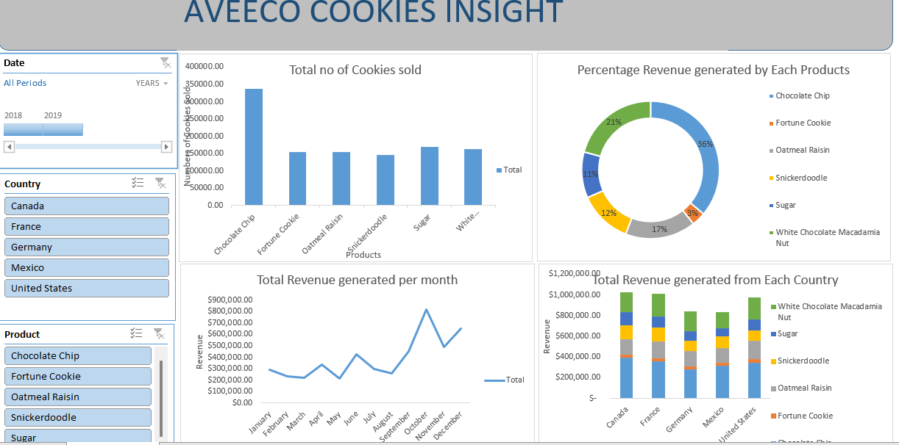
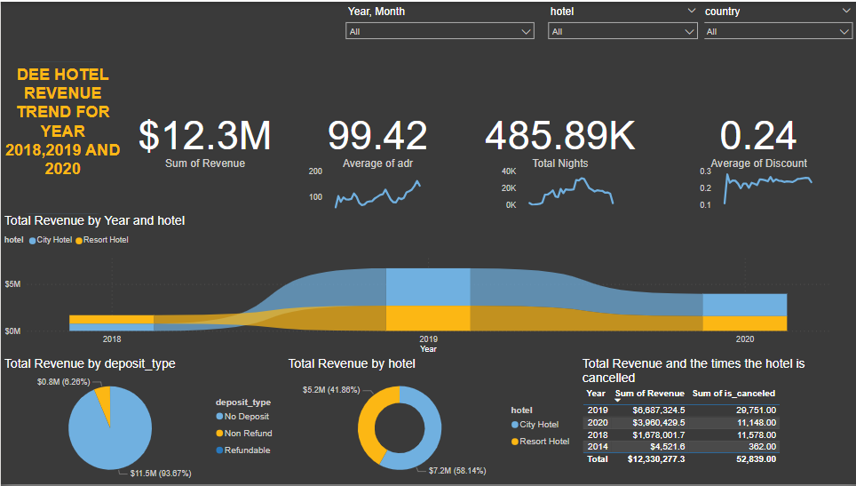
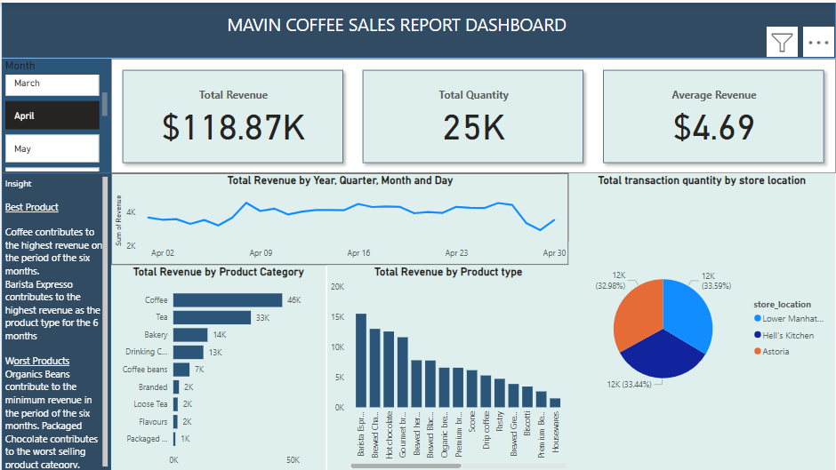
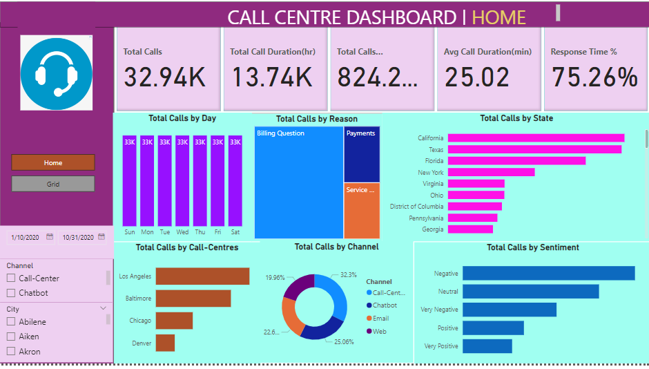
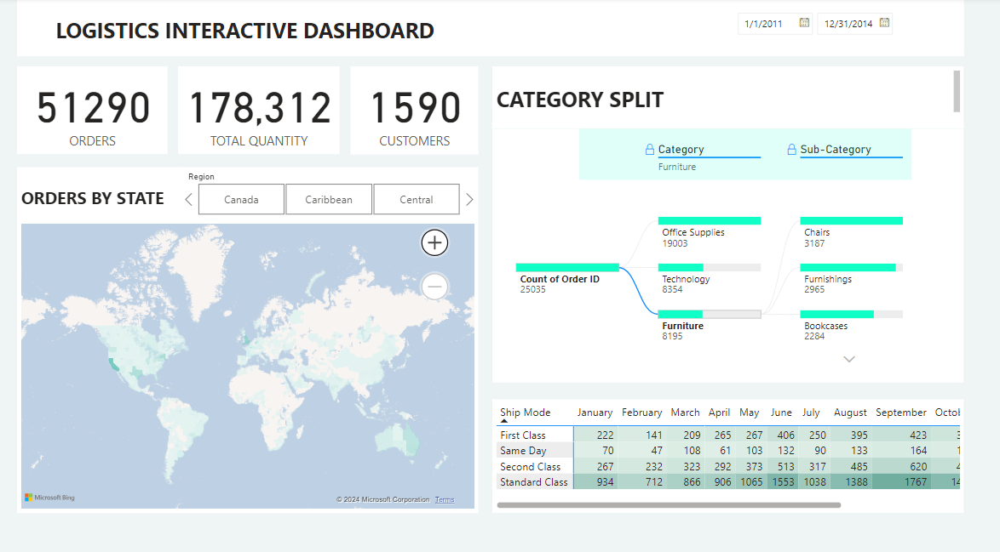

# Mayowa Akomolafe Data Analytics Project
# Project 1 
**Title:** [Human Resources Interactive Employee Dashboard](https://github.com/Mayowa2/Data-Analytic-Project)

**Project Summary:** The objective of this dashboard is to depict the proportion of employees approaching retirement age compared to those currently active in the organization. Additionally, it seeks to analyze the ratios of employee distances from the office, including those who have been retrenched or promoted. Furthermore, the dashboard provides insights into the tenure of employees' service, along with a breakdown of employee counts. It also categorizes employees into different hierarchical levels within the organization.

**Overview:** 


# Project 2
**Title:** [Aveeco Cookies Insight Dashboard](https://github.com/Mayowa2/Data-Analytic-Project)

**Project Summary:**  This dashboard provides an overview of Aveeco Cookies' profit, revenue, and sales across various countries. It offers valuable insights into the most popular cookie variants and the countries contributing the highest revenue. Additionally, it highlights the peak months for cookie sales throughout the year, aiding in strategic decision-making regarding production allocation and market focus.

**Overview:**



# Project 3
**Title:** [Pizza Sales Report](https://github.com/Mayowa2/Data-Analytic-Project)

**Project Summary:**   This dashboard serves to illustrate the peak day and time of activity, along with the sales performance of individual pizzas. It provides insights into total revenue, average order value, and average sales for each pizza variant. Additionally, it presents daily and monthly sales trends, pinpointing peak sales periods for the week and month. Pizza categories and sizes are compared, highlighting the most successful types. Moreover, it identifies the best and worst-selling pizzas, aiding decision-making regarding production adjustments and discontinuation of certain varieties.

**Overview:**


# Project 4
**Title:** [Hotel Booking](https://github.com/Mayowa2/Data-Analytic-Project)

**Project Summary:**  The objective of this dashboard is to illustrate the revenue trends over the years 2018, 2019, and 2020. It provides insights into total revenue, average sales, total nights booked, and discounts offered to guests. Additionally, it identifies the peak revenue year and the city with the highest revenue, enabling the business to prioritize resources towards hotels generating the most revenue.

**Overview:**



# Project 5
**Title:** [Data Cleaning Portfolio Nashville](https://github.com/Mayowa2/Data-Analytic-Project)

**Project Summary:**  This project is a data cleaning project on a raw data with the use of SQL. The substring, charindex, parsename, join was used to manipulate and clean the raw data into a much more meaningful data for analysis.

**Overview:**

```sql
SELECT A.ParcelID, A.PropertyAddress, B.ParcelID, B.PropertyAddress, ISNULL(A.PropertyAddress,B.PropertyAddress)
FROM [dbo].[NashvilleHousing] A
JOIN [dbo].[NashvilleHousing] B
ON A.ParcelID = B.ParcelID
WHERE A.[UniqueID ]!=B.[UniqueID ]
AND A.PropertyAddress IS NULL
```

**Sql Query:**


# Project 6
**Title:** [Nike Sales Trend](https://github.com/Mayowa2/Data-Analytic-Project)

**Project Summary:**  The objective of this dashboard is to show the sales trends of Nike product for the year 2021. It provides insights into total revenue, total products sold, the top product on the chart, and the top region where sales was made the highest. Additionally, it identifies the peak revenue month and the state with the highest revenue, enabling the business to prioritize resources towards the product generating the most revenue.

**Overview:**


# Project 7
**Title:** [APPLE INDUSTRIES](https://github.com/Mayowa2/Data-Analytic-Project)

**Project Summary:**  The objective of this dashboard is to show the sales trends of Apple Industries product for the year 2022. It provides insights into total revenue, total products sold, the top product on the chart, and the top region where sales was made the highest. Additionally, it identifies the peak revenue month and the sales method used giving us insight the best sales method to use for future sales that will generating the most revenue.

**Overview:**


# Project 8
**Title:** [MAVIN COFFEE](https://github.com/Mayowa2/Data-Analytic-Project)

**Project Summary:**  The objective of this dashboard is to show the sales trends of Mavin Product Category and type  for the 1st quarter of 2023. It provides insights into total revenue, total quantities sold, the top product on the chart, and the region where sales was made the highest. Additionally, it identifies the peak revenue month giving us insight thehighest product that generate highest revenue.

**Overview:**



# Project 9
**Title:** [CALL CENTRE DASHBOARD](https://github.com/Mayowa2/Data-Analytic-Project)

**Project Summary:**  This dashboard shows the business needs of the Call Centre company. It illustrates the KPI's requirement of the business such as Total calls, Total calls duration and the percentage response time of each call made by each customers. It provides insights into total call by day, total call by State, total calls by Channel, Total call by sentiment, and the total call by each call centers showing each performance by each day. Also, it contains the grid page of each customer's information to be sent to each centres manager.

**Overview:**




# Project 10
**Title:** [LOGISTICS DASHBOARD](https://github.com/Mayowa2/Data-Analytic-Project)

**Project Summary:**  This dashboard shows the business needs of a company. It illustrates the KPI's requirement of the business in its logistics such as Total orders, Total calls quantities and the total numbers of customers making orders. It also provides insights into the volume of different categories ordered, the type of shipping mode and its total volume of orders and the region in which the orders took place.

**Overview:**


